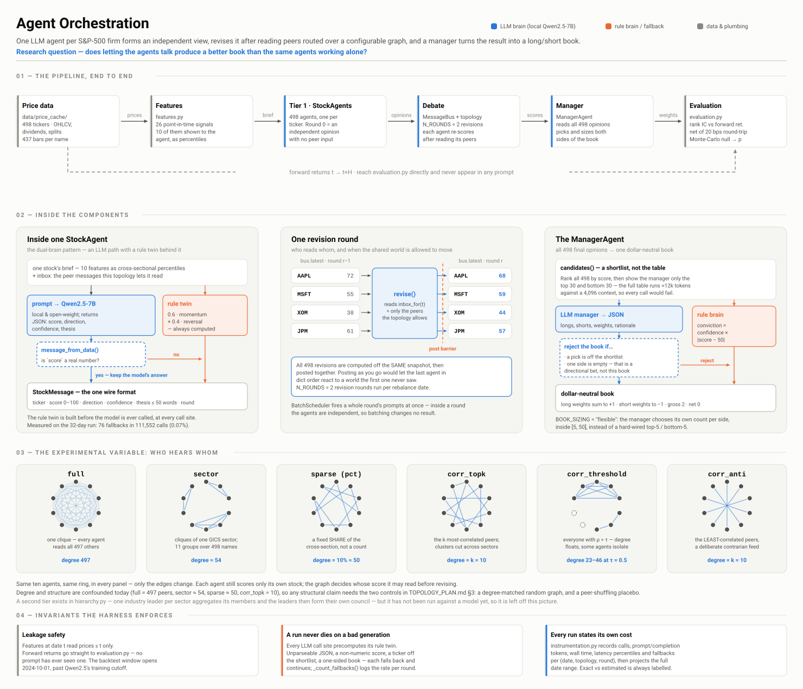

# Multi-Agent Long/Short: Communicating LLM Agents for Equity Portfolios

**Research question:** does letting one LLM agent per stock *talk to other stock agents* produce a
better long/short portfolio than the same agents reasoning alone? And if so, **which communication
structure** (all-to-all, same-sector, correlation-based, or hierarchical) helps most?

The system assigns one LLM agent to every stock in the S&P 500 (498 firms). Each agent first forms an
independent view of its own stock. It then revises that view after reading its peers' opinions,
which are routed over a configurable communication graph. A manager agent turns the final opinions
into a dollar-neutral long/short book, and the book is graded on out-of-sample returns against a
Monte-Carlo null.

> **Status: active research, work in progress.** The full pipeline runs end-to-end with a local
> 7B model on 498 agents. The communication hypothesis is **not yet supported** by the results so
> far (see [Results so far](#results-so-far)).



---

## Highlights

- **498 LLM agents, zero API cost.** Everything runs on open-weight models (Qwen2.5 0.5B/7B/14B),
  served locally through **vLLM** with batched inference on an A100 or run in-process with
  HuggingFace `transformers`. The system never calls a paid API.
- **Protocol decoupled from the agents.** Rounds, who-hears-whom, and aggregation live entirely
  outside the agent, so the communication structure can be changed without touching how an agent
  reasons.
- **Six communication topologies plus a three-tier hierarchy:** `full`, `sector`, `sparse`
  (a percentage of the cross-section), and correlation-gated `corr_topk`, `corr_threshold` and
  `corr_anti` (rewired daily or monthly from trailing returns). The hierarchy adds 11 industry
  leaders and a leader council above the stock agents.
- **Leakage-safe by construction.** The backtest window (Oct 2024 → Jun 2026) starts *after* the
  model's training cutoff. Features at date *t* use only prices ≤ *t*, and forward returns go only to
  the evaluator and never into a prompt.
- **Honest evaluation harness.** It reports rank-IC, long/short spread, turnover with round-trip
  transaction costs, gross *and* net returns, and a **Monte-Carlo null** of 5,000 random books that
  gives a percentile and a p-value.
- **Every LLM call has a rule-based twin.** A malformed generation falls back to the rule instead
  of crashing a run, and every fallback is counted and logged, so an "LLM" result that is secretly
  rule-based cannot go unnoticed.
- **Full observability.** Each message from each agent in each round is written to JSONL together
  with the exact peer messages the agent saw. The information flow through the graph can therefore
  be reconstructed.
- **Token and time budgeting.** Each run records calls, prompt and completion tokens, latency
  percentiles and fallbacks, labels each count as exact or estimated, and projects the GPU hours
  needed for the full date range and for each additional topology.

## How it works

```
data/price_cache  ──►  features.py          point-in-time technical + cross-sectional features
                         │                  (momentum, reversal, RSI, MACD, vol, beta, residual momentum, ...)
                         ▼
                   StockAgent × 498         round 0: independent opinion on its own ticker
                         │
      topology.py / correlation.py          who hears whom: full | sector | sparse | corr_*
                         │
  MessageBus + BatchScheduler               rounds 1..N: each agent reads its neighbours'
                         │                  messages and revises (one batched LLM call per round)
                         ▼
   ManagerAgent (or hierarchy.py)           final opinions → signed conviction weights
                         │                  (longs sum to +1, shorts to −1)
                         ▼
                   evaluation.py            rank-IC, spread, turnover, costs, Monte-Carlo null
```

Agents exchange one structured message type (`messages.StockMessage`):

```
ticker · score (0–100) · direction (LONG/SHORT/NEUTRAL) · confidence (0–1) · thesis (≤50 words) · round
```

Structured messages keep prompts small for local models and make it possible to measure how
information propagates through the network.

Within a revision round, all agents read the *same* snapshot before anyone posts, so the order in
which agents run cannot change the outcome. The expensive round 0 runs **once per date** and is
replayed for every topology, which gives a matched no-communication vs communication comparison
from a single model pass.

## Quick start

Requires Python 3.9+ and `requests`. The core is standard-library only by design, so the arithmetic
is easy to audit.

```bash
pip install -r requirements.txt

python download_prices.py             # populate data/price_cache/ (Yahoo daily OHLCV)
python run_demo.py                    # one rebalance, rule-based agents, prints rounds + book
python run_analysis.py                # weekly walk-forward over all configurations
python run_daily_backtest.py          # daily manager-agent backtest → Sharpe + per-day CSV
python topology_report.py             # degree / token cost / stability of every topology
```

With no `LLM_BACKEND` set, every agent uses its rule-based brain, so the commands above run in
seconds on a laptop.

### With a local LLM

```bash
# in-process (CPU smoke test; shrink the problem)
export LLM_BACKEND=transformers LLM_MODEL=Qwen/Qwen2.5-0.5B-Instruct
DEMO_N=10 MAX_DATES=1 python run_llm_analysis.py

# against a local vLLM / Ollama server (the real experiments)
export LLM_BACKEND=openai-compatible LLM_MODEL=Qwen/Qwen2.5-7B-Instruct LLM_BASE_URL=http://localhost:8000/v1
python run_llm_analysis.py
```

On a SLURM cluster, `serve_vllm_gpu.sh` starts vLLM on a GPU node, runs the walk-forward, and shuts
the server down. The `*_3day.sh` scripts run the long weekly and daily jobs.

| Variable | Effect |
|----------|--------|
| `LLM_BACKEND` | `none` (default, rule-based) · `transformers` · `openai-compatible` |
| `LLM_MODEL`, `LLM_BASE_URL` | model id; HTTP endpoint for the server backend |
| `UNIVERSE` | `dow30` for the original 30-name universe (default: all 498 S&P 500 firms) |
| `TOPOLOGY` / `TOPOLOGIES` | override the topology (single / comma-separated list) |
| `DEMO_N`, `MAX_DATES` | truncate tickers / rebalance dates for smoke tests |

Research knobs such as the number of rounds, book sizing, feature set, correlation window and
refresh rate, and the hierarchy settings are in `config.py`.

## Repository layout

| Area | Files |
|------|-------|
| Agents | `stock_agent.py`, `manager_agent.py`, `hierarchy.py` (industry leaders + council) |
| Protocol | `messages.py`, `topology.py`, `correlation.py`, `message_bus.py`, `batch_orchestration.py` |
| LLM access | `llm.py`, `llm_utils.py` (local backends), `batch_llm.py` (concurrent vLLM client) |
| Data & features | `download_prices.py`, `data_loader.py`, `features.py`, `update_sp500_list.py`, `fetch_market_cap.py` |
| Evaluation | `evaluation.py`, `instrumentation.py`, `transcript.py`, `inspect_run.py` |
| Entry points | `run_demo.py`, `run_llm_demo.py`, `run_analysis.py`, `run_llm_analysis.py`, `run_daily_backtest.py`, `run_hierarchy_backtest.py` |
| Docs | `TOPOLOGY_PLAN.md` (topology roadmap and methodology), `docs/DEVELOPMENT_LOG.md` (phase-by-phase build log), `docs/framework.svg` |

## Results so far

All results use **Qwen2.5-7B-Instruct** with 2 revision rounds and 20 bps round-trip costs. "p" is
the one-sided p-value against 5,000 random long/short books over the same dates.

**Weekly walk-forward, 498 agents, 32 rebalance dates**
(`results/llm_analysis_sparse-sector-corr_topk_498x32.json`, 0 agent fallbacks)

| Configuration | Mean IC | Gross cum. | Net cum. | Sharpe | p |
|---|---:|---:|---:|---:|---:|
| No communication (round 0) | −0.013 | −23.2% | −26.8% | −1.07 | 0.95 |
| Comm: sparse (10%) | −0.004 | −11.1% | −16.2% | −1.11 | 0.75 |
| Comm: sector | −0.010 | −4.4% | −9.9% | −0.47 | 0.59 |
| Comm: corr_topk (k=10) | −0.010 | −11.3% | −16.3% | −0.76 | 0.75 |

**Reading this honestly.** In this window every communication topology loses less than the
no-communication baseline, and `sector` loses the least. That is consistent with the hypothesis that
comparing a stock with its economic peers helps. However, **no configuration beats random stock
picking** (all p ≫ 0.05), so this is not yet evidence that communication creates alpha. Two further
caveats apply: 32 dates is a short sample, and in the daily manager-agent run 76 of 96 manager
decisions fell back to the rule brain because of unusable JSON. That manager path needs fixing
before its numbers mean anything.

## Known limitations and roadmap

- **Universe:** current S&P 500 membership, not point-in-time membership, so the backtest has
  survivorship bias. `value` is a short-term-reversal proxy, not a fundamentals-based factor.
- **Confounded structure:** topology is currently confounded with degree (`full` gives 497 peers,
  `sector` about 54, `sparse` about 50). A **degree-matched random-graph control** and a
  **peer-shuffling placebo** are planned so that structural claims can be isolated
  (`TOPOLOGY_PLAN.md` §3).
- **Flexible book sizes** need a matched Monte-Carlo null before their p-values can be quoted.
- **Next:** full-length 74-week and 373-day runs, the hierarchical industry-leader setting at scale,
  agent memory fed back into prompts, and news co-mention graphs as a communication topology.

## Author

**Muntasir Shohrab** — New Jersey Institute of Technology
